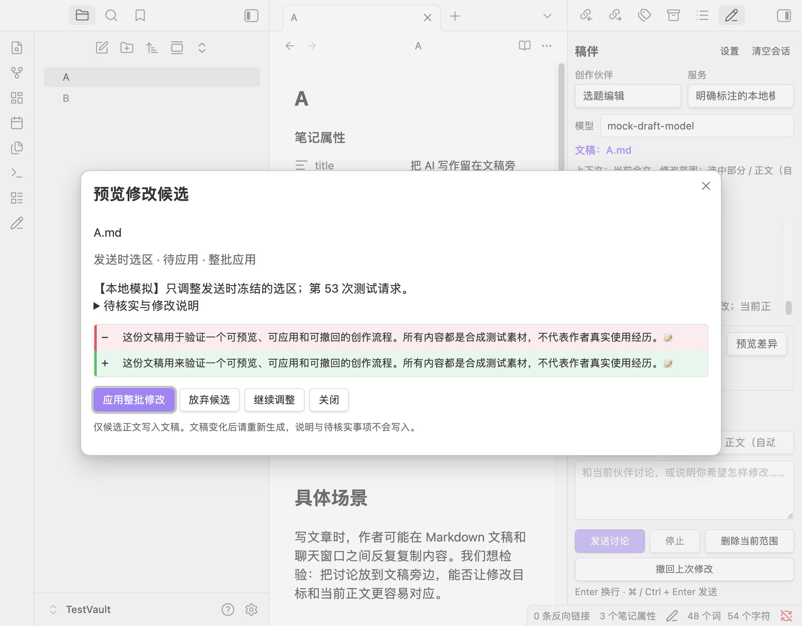

# Draft Companion · 稿伴

Draft Companion is an Obsidian desktop plugin for discussing, reviewing, and revising the active Markdown draft. It offers six editable AI writing partners, note-specific conversations, streamed responses, diff previews, frozen selection editing, frontmatter protection, conflict checks, and conditional undo. The writing interface is currently in Chinese.

## English overview

Connect your own OpenAI-compatible chat provider or a compatible local service, select a model, and start with any writing task. Discussion replies remain in the sidebar. Revision replies become candidates: review the diff and explicitly apply it before any text changes. Explanations and verification notes are never written into the draft. The plugin reads the latest editor buffer before each request and refuses to apply an edit or undo when the document has changed.

Requires **desktop Obsidian 1.11.4 or later**. Mobile is not supported. Download the plugin ZIP from [Releases](https://github.com/zibochen6/draft-companion/releases/latest), unzip it, place the `draft-companion` folder in `<Vault>/.obsidian/plugins/`, and enable Draft Companion in Community plugins. The source archives are for development and do not contain the compiled plugin. Community directory submission is in progress; an approved release and published listing are required before in-app installation is available.

The plugin is free and requires no Draft Companion account. Your chosen AI service may require its own account, API key, and paid usage; a compatible local service can also be used. Each writing request sends the current draft, note requirements, writing preferences, active partner rules, and that note's conversation to the configured provider. API keys are referenced through Obsidian's official secret storage and only used in authentication headers. Saved local conversations, candidates, and the latest undo version may travel with your own sync setup.

Draft Companion has no telemetry, ads, hosted backend, automatic retries, or self-updater. It does not scan the vault, expand embeds or images, fetch links, verify facts online, or publish articles. Clipboard use only copies a response or a saved previous draft after an explicit click; it does not read the clipboard. Cancelling disconnects the local request but cannot guarantee that the provider stops charging. Node networking does not automatically inherit system/PAC proxies.

The release workflow verifies code and builds installation assets when a new version tag is published. Once listed, users install updates through Obsidian's **Check for updates** control. See [verification](docs/VERIFICATION.md), [known live-provider results](docs/REAL_API_VERIFICATION.md), and [release maintenance](docs/RELEASING.md). The project and bundled dependency licenses are included in the runtime.

## 中文说明

围绕当前 Markdown 文稿讨论、审稿和改稿的 Obsidian 桌面插件。修改先生成候选，经过差异预览与确认后写入文稿；首版用于公众号文章创作，也可编辑伙伴规则以用于其他题材。



开源源码：[zibochen6/draft-companion](https://github.com/zibochen6/draft-companion)。下载安装文件：[GitHub Releases](https://github.com/zibochen6/draft-companion/releases/latest)。官方社区目录条目已创建，正在修正自动审核反馈；**尚未收录到插件市场**。

## 安装

需要 **Obsidian 桌面版 1.11.4 或以上**。最低版本依据所用官方密钥 API 确定；实际测试的应用版本、已完成与待完成验证见 [验证记录](docs/VERIFICATION.md)。移动端不在 V0.1 范围内。

1. 先在独立测试 Vault 中安装并试用，使用 [合成测试文稿](fixtures/测试文稿.md)。
2. 从 GitHub Release 下载最新的 `draft-companion-<版本>.zip` 并解压，或分别下载 `main.js`、`manifest.json`、`styles.css` 放入 `draft-companion` 文件夹。源码仓库不提交编译文件；开发构建后也可使用 `dist/draft-companion/`。
3. 手动将该文件夹放入所选 Vault 的插件目录：`<Vault>/.obsidian/plugins/draft-companion/`。这里是安装步骤；开发代理不会浏览你的日常 Vault 隐藏目录。
4. 在 Obsidian 的社区插件设置中允许社区插件、刷新列表并启用 **Draft Companion**。
5. 点击左侧铅笔按钮，或在命令面板运行 **Draft Companion: 打开创作侧栏**。

更新时只替换上述三个运行文件，然后重载插件。保留既有插件数据即可保留配置、编辑过的伙伴与本文会话。分发包不含用户数据或密钥。

社区目录审核通过并发布后，可在 Obsidian 设置 → 社区插件 → 浏览中搜索 `Draft Companion` 并安装。目录当前要求英文介绍，中文名称“稿伴”作为插件界面名称，不保证可用于市场搜索。此后在“检查更新”中获取新版；官方社区插件不会静默自动更新。推送源码不会让已安装插件立即更新，维护者需要发布新的版本。发布维护步骤见 [发布说明](docs/RELEASING.md)。

## 配置服务和模型

在侧栏点击“设置”，添加兼容 OpenAI 聊天接口的服务。填写名称和 API 根地址，例如 `https://api.openai.com/v1` 或你服务商提供的自定义路径。插件只追加 `/models` 与 `/chat/completions`，不会猜测或补上 `/v1`，不支持其他服务商的全部原生协议。

通过 **Obsidian 密钥管理器**选择或新建 API 密钥。插件普通配置保存密钥名称引用，运行时用官方 `SecretStorage` 取用；本项目不自行实现加密，也不对底层存储方式作额外承诺。无需认证的本地服务可留空。删除服务只删除其配置，保留 Obsidian 中可供其他插件共享的密钥。

保存服务后点击“获取模型并选择”，搜索并选择模型，再执行“独立聊天测试”。模型列表成功和聊天测试成功是两个分别显示的状态；认证、网络、接口不支持、格式不兼容、服务错误会给出不同提示。列表接口不可用时，在服务配置的高级入口手动填写模型 ID，然后直接测试聊天。

可添加、编辑和删除多个服务，首版所有伙伴使用侧栏当前选定的服务与模型。请求开始后固定这一次的连接、模型和规则；生成途中调整配置只影响下一轮。

默认流式输出；不支持流式的服务可以在配置中关闭。可设置 1–600 秒超时和服务已确认的上下文容量。容量校验使用粗略估算并预留 1024 token 输出余量，只有配置容量上限后才进行本地预检；没有模型容量元数据时不猜上限。超限会提示，不会偷偷截断全文、改成摘要或删除历史。

## 写作流程

打开并聚焦一篇 Markdown 文稿后，稿伴会绑定最近聚焦的文稿。点击侧栏输入框不会解除绑定；始终检查侧栏显示的文稿路径。可以从任意阶段开始，不必填完表单或先经过选题、大纲。

预设包含 **选题编辑、大纲编辑、初稿作者、责任编辑、改稿编辑、标题与发布检查**。每个伙伴有独立规则、默认讨论或改稿方式及快捷任务。快捷任务只填入输入框，确认后才发送。设置中可新增、复制、编辑和删除伙伴；预设只在首次初始化时创建，重启不会覆盖已编辑的规则。

“全局创作偏好”用于保存读者、语气和常写题材；侧栏的“本文要求”按文稿保存。两者均可留空，不会推断公众号名称或作者署名。

- **讨论**：普通建议、大纲、审阅意见或标题候选。不会写入文稿。
- **改稿 + 正文**：理解最新全文，替换正文，保护开头 YAML frontmatter 的原始字符。
- **改稿 + 选区**：理解全文，只替换发送时选择的那一个连续范围。需要编辑模式且选区不为空；选区进入 frontmatter 时会阻止修改。
- **自动范围**：发送时有单个非空选区就使用选区，否则使用正文。

每次发送都重新取得文稿最新全文，并加入本文要求、全局偏好、当前伙伴规则和本文历史。选区在发送时固定；生成后挪动光标或选择其他文字不会改变旧候选的写入位置。

## 预览、应用和撤回

改稿成功后点击“预览差异”，检查增加与删除的内容，再“应用整批修改”或“放弃候选”。V0.1 只整批应用，不逐条合并。候选说明与待核实事项不写入正文；空回答、无效 JSON、截断响应不会成为可应用改稿。需要删除文字时使用“删除当前范围”，同样先生成删除候选并预览确认。

从发送到应用期间，只要正文发生任何变化，旧候选就会失效，避免覆盖新内容；请基于最新正文重新生成。新候选会替代旧的待应用候选。切换文稿不会把候选应用到另一篇笔记，删除或同名重建文件也不会让旧候选接管新文件。

“撤回上次修改”只处理当前文稿最近一次成功应用的 AI 修改，并恢复该次写入范围。正文已有后续变化时拒绝覆盖；可以通过“查看上次修改前版本”查看保存的旧全文，再决定如何继续编辑。重命名会跟随当前文稿更新关联，跨应用移动或重新创建导致身份无法确认时，需要重新生成。

会话按文稿隔离保存；历史会标记伙伴、模型、候选未应用、已应用、已放弃、已撤回或失效状态，模型输出不会自动成为已验证素材。清空当前会话不会删除正文，保留本文要求与最近撤回记录。

## 停止与失败

点击“停止”会立即退出本地生成状态、作废迟到结果并中止底层网络连接。不能保证服务端停止计算或停止计费。已接收的部分回答会保留为中断材料，不会成为可应用修改。插件关闭或重启后会标记中断，不会自动重发请求。

遇到错误，先查看提示并检查服务配置。原文不会因生成失败而修改。插件没有自动重试；已经收到部分内容后，也不会隐蔽地重新请求全文。数据损坏或来自未来版本时拒绝加载并保留原数据，不会静默重置。

## 内容与能力边界

每次发送会将**目标文稿最新全文、本文要求、全局偏好、当前伙伴规则与本文会话**提交给你选择的模型服务商。API 密钥只进入认证请求头，不进入提示词、会话、文稿或普通日志。

本地插件数据包含会话、候选基线、候选正文及最近撤回版本，可能随你的同步方案同步；这些内容没有由稿伴加密。不要把会话存储理解为密钥保险箱。本插件不会扫描全库，不展开双链、图片或嵌入，也不读取用户仅提供的网页链接。

插件自身免费使用，无需注册稿伴账户。你选择的第三方模型服务可能要求账户、API 密钥并按用量收费；这些费用和服务方数据处理条款由该服务商决定。无需认证的本地兼容服务也可使用。稿伴没有自建服务器、遥测或广告，也不会自行安装或更新插件及依赖。

“发布前检查”只检查当前文章与发布文案，不表示已经联网核实事实、验证最新平台限制或在公众号后台发布。首版没有搜索、RAG、自动多伙伴流水线、封面生成、公众号 HTML 排版或后台发布。

桌面请求使用 Node HTTP/HTTPS，避免浏览器 CORS 限制，支持流式与取消。它不会自动继承 Chromium 的系统/PAC 代理；需要依赖这种代理的网络环境，应先通过独立聊天测试确认连接。插件不会自动跟随重定向转发密钥。

## 开发与本地模拟

```sh
npm install
npm test
npm run build
npm run package
```

构建生成 `main.js`，打包只将 `main.js`、`manifest.json`、`styles.css` 放入可安装目录 `dist/draft-companion/`、带版本号的目录和 ZIP。本地构建没有发布、推送、社区审核或文章发布动作。

本地构建不会发布。GitHub Actions 在 `main` 推送或 Pull Request 时检查代码；只有显式推送与 manifest 版本一致的纯数字版本标签（如 `0.1.0`）才构建并发布 Release。首次创建仓库时已配置此流程。

无需真实密钥即可验证流程：

```sh
node scripts/mock-provider.mjs --port 43127 --delay 20
```

在专用测试 Vault 中使用 `http://127.0.0.1:43127/v1`，不填写密钥，获取并选择 `mock-draft-model`。测试输入可用 `TEST:DISCUSS`、`TEST:EDIT`、`TEST:REVIEW`、`TEST:TITLE`；`TEST:SLOW` 便于测试停止。精确测试修改可写 `TEST:EDIT TEST:REPLACE("原词", "新词")`。模拟服务遵守冻结范围，保持选区之外的内容。

该服务只有确定性模拟响应，不代表真实模型能力。**仅发送合成测试材料**：`GET http://127.0.0.1:43127/__requests` 可查看仅保存在内存中的测试消息，用于检查最新全文和历史；不记录请求头或密钥，服务退出后记录消失。

架构与实现约束见 [实现说明](docs/IMPLEMENTATION.md)。真实验证结论以 [验证记录](docs/VERIFICATION.md) 为准。

本版已使用 `api.meai.cloud` 的 `claude-haiku-4-5` 验证真实网络与核心改稿操作；实测也出现过流式结束格式异常和模型额外改字。完整结果与边界见 [真实 API 验证](docs/REAL_API_VERIFICATION.md)。分发包不含本轮凭据。

## 许可

本项目采用 [MIT](LICENSE) 许可。第三方依赖的版权和许可见 [THIRD_PARTY_NOTICES.md](THIRD_PARTY_NOTICES.md)，这些声明也随编译文件分发。
