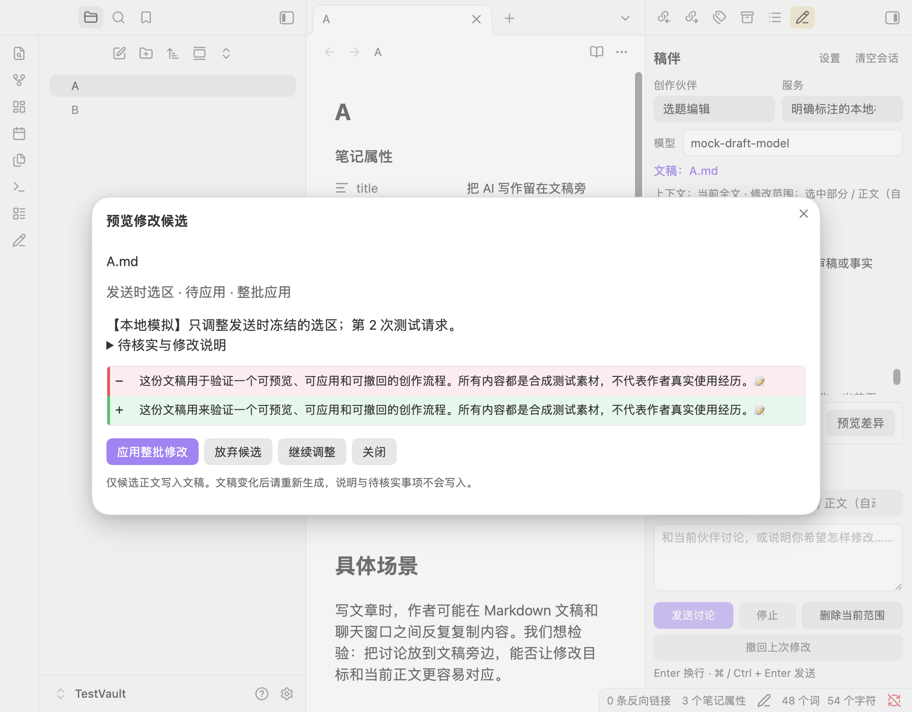

# Draft Companion · 稿伴

**[中文文档 / Chinese documentation](README.zh-CN.md)**

Draft Companion is a Chinese-language desktop plugin for Obsidian that helps you discuss, review, and revise the Markdown note you are actively writing. It is designed for a deliberate writing workflow: AI output stays in the sidebar until you decide to apply a reviewed revision. The plugin does not silently rewrite a note, publish an article, or treat an AI response as verified information.

> Requires **Obsidian desktop 1.11.4 or later**. Mobile is not supported.

The [official community-directory listing](https://community.obsidian.md/plugins/draft-companion) is published. Version 0.1.1 completed its automated review with no blocking errors. Website search for **Draft Companion** is verified. Older client catalogs may take time to synchronize; [GitHub Releases](https://github.com/zibochen6/draft-companion/releases/latest) remains available for manual installation.



## Features

Draft Companion binds its sidebar to the most recently focused Markdown document. Focusing the sidebar does not change that binding, which helps prevent a reply for one draft from being applied to another. Before every request, it reads the most recent editor buffer when one exists; otherwise it reads the note from the vault.

The six built-in, editable writing partners are:

- Topic editor
- Outline editor
- First-draft writer
- Managing editor
- Revision editor
- Title and publishing checker

Each partner has its own rules, default mode, and quick tasks. You can add, duplicate, edit, or remove partners. The defaults are created only once, so later upgrades do not overwrite your changes. Global writing preferences and note-specific requirements are optional and remain separate from the document body.

Use **discussion** mode for ideas, outlines, reviews, titles, and suggestions. Those answers stay in the conversation. Use **revision** mode to create a structured edit candidate. A candidate contains a replacement plus explanation and follow-up notes, but only the replacement can be applied to the note. Explanations, caveats, and items to verify are never written into the draft.

Revision candidates always have a fixed target: either the full body or the one non-empty selection that existed when the request was sent. The automatic scope uses a single selection when present and otherwise uses the body; you can explicitly choose either scope. YAML frontmatter is protected as original text. The plugin refuses to revise malformed frontmatter or a selection that crosses into it. An empty replacement never means deletion: use the separate **Delete current scope** action to generate a deletion candidate and review it in the same way.

## Install from a release

1. Download the latest `draft-companion-<version>.zip` from [GitHub Releases](https://github.com/zibochen6/draft-companion/releases/latest).
2. Unzip it and place the resulting `draft-companion` folder in `<Vault>/.obsidian/plugins/`.
3. In Obsidian, enable Community plugins if necessary, then enable **Draft Companion**.
4. Click the pencil icon in the ribbon or run **Draft Companion: 打开创作侧栏** from the command palette.

The release ZIP contains the three runtime files: `main.js`, `manifest.json`, and `styles.css`. You may also download those three files individually and put them in the same folder. A source-code archive is for development and does not include the compiled plugin.

For a first trial, use a separate test vault and the included [synthetic test note](fixtures/测试文稿.md). The plugin’s interface is Chinese. The fuller Chinese setup and workflow guide is available in [README.zh-CN.md](README.zh-CN.md).

Once your client’s catalog includes the published listing, search for **Draft Companion** in Obsidian’s Community plugins browser. After that, use Obsidian’s **Check for updates** control to install newer releases. Community plugins do not update silently, and pushing source code alone does not update an installed plugin.

## Configure an AI provider

Open **设置 (Settings)** in the sidebar and add an OpenAI-compatible chat provider or a compatible local service. Enter its API root URL, choose or create an API key in Obsidian’s secret manager, fetch a model list, select a model, and run the independent chat test.

The Base URL is used exactly as configured except for a trailing slash: Draft Companion appends `models` or `chat/completions` and never guesses or inserts `/v1`. This supports providers behind a custom path, while avoiding hidden protocol rewrites. If model discovery is unsupported, enter a model ID manually in the advanced provider options and run the chat test directly.

Providers can be added, edited, and removed. All partners use the currently selected provider and model in this first version. A request freezes its provider, model, partner rules, full text, range, and user instruction when it begins; changing settings affects only the next request. Streaming is enabled by default and can be disabled for compatible non-streaming services. You can set a 1–600 second timeout and, when you have reliable information, a context limit. Capacity checks are estimates with output headroom: Draft Companion does not silently truncate the note, summarize it, or discard conversation history to make a request fit.

The model-list test and chat test are reported separately. Authentication, network, unsupported-interface, response-format, context, and service errors are distinguished. Requests use the desktop host’s Node HTTP/HTTPS transport, so they are not subject to browser CORS; that transport does not automatically inherit system or PAC proxy settings. Test a provider explicitly in proxy-dependent environments.

## Safe revision and undo

For a revision response to become applicable, it must finish normally and pass the expected structured-response validation. Invalid JSON, empty or incomplete responses, cancelled requests, broken connections, and truncated streams cannot become an edit candidate. A response may be wrapped in one complete JSON code fence, but other formatting is rejected.

Open **Preview diff** to inspect the target path, scope, and complete batch diff. Choose to apply the batch, discard it, or continue the conversation. Only one current candidate exists per document. A newer candidate supersedes the previous pending candidate, and candidate status is retained in later context.

Before applying, the plugin compares the newest document text with the candidate baseline. If the document changed, was deleted, was replaced by another document at the same path, or no longer has a matching identity, it blocks the edit. In an open source editor it uses an editor transaction; otherwise it uses a vault processing callback for the final comparison and replacement. This protects text outside the requested scope and avoids read-then-overwrite behavior. Applying the same candidate twice is impossible.

The **Undo last AI edit** command retains the latest successful AI change for the current document. Undo is available only when the current full text exactly matches the expected post-edit state. If you have made later changes, Draft Companion refuses to overwrite them and lets you inspect the saved previous version before deciding what to do next.

## Privacy, cost, and boundaries

Draft Companion is free and does not require a Draft Companion account. The AI service you select may require an account, API key, and paid usage. Its charges and data-processing terms are determined by that provider. A compatible local service can be used without a key.

For each request, the plugin sends the current full target draft, note requirements, global preferences, the active partner rules, and the document’s conversation to the selected provider. API keys are obtained through Obsidian’s official secret storage and are sent only as authentication headers; ordinary plugin settings keep a secret reference, not the key itself. Local plugin data includes conversations, candidate baselines and text, and the latest undo version. Depending on your sync setup, that local data may sync with your other devices.

The plugin has no hosted backend, telemetry, ads, automatic retry, automatic model fallback, or self-updater. It does not scan the vault, read other notes through links or embeds, fetch remote images, open links automatically, read the clipboard, browse the web to verify facts, or operate a publishing platform. A user click can copy a response or a saved prior draft. Stopping a request immediately invalidates its local result and closes the connection, but cannot guarantee that a remote provider stops work or billing.

## Development and release maintenance

Install dependencies and run the local checks with:

```sh
npm install
npm test
npm run build
npm run package
```

The package command produces `main.js`, a distributable `dist/draft-companion/` folder, a versioned folder, and a ZIP containing only the three runtime files. It does not publish anything. GitHub Actions checks pushes to `main` and pull requests. Publishing a stable numeric version tag that exactly matches the manifest version builds the runtime assets and creates a GitHub Release. Use the [latest-release URL](https://github.com/zibochen6/draft-companion/releases/latest) for installation.

The deterministic mock provider can exercise the workflow without a real key; details are in the [Chinese documentation](README.zh-CN.md#开发与本地模拟). Implementation constraints, validation records, live-provider limits, and maintainer release instructions are documented in [IMPLEMENTATION.md](docs/IMPLEMENTATION.md), [VERIFICATION.md](docs/VERIFICATION.md), [REAL_API_VERIFICATION.md](docs/REAL_API_VERIFICATION.md), and [RELEASING.md](docs/RELEASING.md).

## License

Draft Companion is released under the [MIT License](LICENSE). Bundled dependency notices are in [THIRD_PARTY_NOTICES.md](THIRD_PARTY_NOTICES.md) and are included with the runtime distribution.
