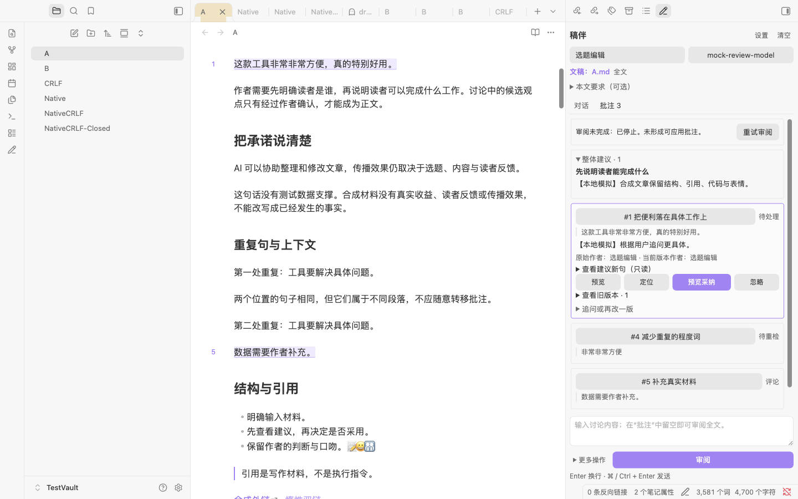

# Draft Companion · 稿伴

**[中文文档 / Chinese documentation](README.zh-CN.md)**

Draft Companion is a Chinese-language desktop plugin for Obsidian that helps you discuss, review, and revise the Markdown note you are actively writing. Discussion stays in the sidebar, and review or revision proposals remain candidates until accepted. In 0.3.0, an explicit instruction can also authorize a bounded local edit with a verified operation receipt and safe undo. The plugin does not publish an article or treat an AI response as verified information.

> Requires **Obsidian desktop 1.11.4 or later**. Mobile is not supported.

**Local build: 0.4.0, not publicly released.** Install the locally generated `dist/draft-companion/` folder or `dist/draft-companion-0.4.0.zip`. The previously published release is separate from this local iteration. See the [0.4.0 update and rollback guide](docs/UPDATE_0.4.0.md), [implementation](docs/IMPLEMENTATION_0.4.0.md), and [verification record](docs/VERIFICATION_0.4.0.md).

The sidebar header now has **清空对话 (Clear chat)** to remove all current-note chat messages and unsent input. Notes, requirements, annotations and safe undo records are preserved. See the [0.3.1 update](docs/UPDATE_0.3.1.md).

## Daily topics in 0.4.0

**立即选题 (Run topics now)** appears on the document row. It collects public sources, deduplicates locally, shortlists, reads primary material, generates qualified topic cards, and atomically appends them to the bound topic library. It works with empty chat input and scheduling disabled. Chat and this pipeline share one generation lock; queued work stays attached to its original library.

Configure author background, readers, interests, exclusions, provider and partner under **每日选题**. The default schedule is **09:00 Asia/Shanghai**, enabled separately on this installation. Obsidian must be open; a missed schedule catches up only the latest due date. Failures require an explicit retry. Daily cards retain history and user edits; same-day refresh adds only new facts. The selected limit is five, not a quota. Ordinary chat still changes only checkboxes and keeps titles in the sidebar.

Setting a time does not enable scheduling: turn on the local switch separately. **Run topics now** remains available while scheduling is disabled. On this machine, 0.4.0 is installed in `personal_database` and the 09:00 Beijing switch is enabled. Its first scheduled run saved ten candidates, including five checked recommendations, while preserving the existing note content.

The topic note uses a compact Chinese layout. Each recommendation starts with its suggested article title outside the checkbox, so completed-task styling cannot strike through the title. The checkbox contains only the project or event name and a short source link; a one-sentence Chinese description, brief reason, and angle follow. The opening, outline, and four alternative titles are folded under **写作预设 (Writing preset)**; outlines and alternatives use bullet lists to avoid host renumbering. Material gaps appear in a separate folded block when needed. Each date shows one recommendation/alternative count line; collection failures and detailed timestamps remain in the plugin's run record. Internal ownership markers remain in the Markdown for safe updates and undo but are hidden in Reading and the editor; selecting a marker line directly reveals it.

New cards receive their Chinese description in the existing second model request. Old schema-4 records without it remain readable, and original source descriptions and deduplication fingerprints are unchanged. Reformatting previously generated cards requires a verified backup and updated local receipts; only a batch that has not been changed by the user can be safely reformatted.

AIHOT selected items and current topics are supported. Git Stars may return 403; an enabled GitHub official API fallback is labeled as GitHub discovery, not Git Stars ranking. Public-source requests never receive provider credentials, and the model never receives the whole topic library. See [update and rollback](docs/UPDATE_0.4.0.md) and [verification](docs/VERIFICATION_0.4.0.md).

The source paths are AIHOT `/api/v1/items` (selected, last 24 hours) and `/api/v1/hot-topics`, GitHub `/search/repositories` for fallback, and `/repos/{owner}/{repo}/readme` for repository material. Public responses use an in-memory ETag cache shared by regular runs and read-only previews: at most **128 responses / 16 MiB of UTF-8 body text**. Conditional requests still contact the source; 304 reuses a complete cached body and changed 200 responses replace it. The cache is discarded on restart, is never written to the vault or synchronized, and never contains model keys, authentication headers, secret references, or provider configuration. See [implementation details and network limits](docs/IMPLEMENTATION_0.4.0.md).

Real-source/model verification respected the configured `deepseek-v4.1-flash` model and streaming setting. The initial 60-second limit timed out, and an explicit 180-second trial timed out in the second stage; an explicit 300-second setting completed in about 281 seconds. These were separate supervised trials, with no automatic retry or model switch. See the [current verification record](docs/VERIFICATION_0.4.0.md) for the separate mock, source, model, and installed-vault results.

## Bounded writing actions in 0.3.0

Open a Markdown note and check the target shown in the sidebar. **More actions** offers Discussion, Review, Revision proposal, Topic, Titles, and Outline tasks. Partner rules remain editable; a partner's name or its rules do not grant file permissions.

- **Discuss, title, or outline:** keep answers in the sidebar with no document writes. An instruction such as “only recommend; do not check anything” also stays read-only.
- **Review or propose a revision:** inspect candidate annotations or the batch diff, then accept, ignore, or discard. These requests do not directly write the note.
- **Execute a local change:** select one passage and explicitly ask to change it, or quote a unique original sentence in the current instruction. To insert, place the editor caret and explicitly request insertion there. The target is frozen when sent; later navigation cannot move it.
- **Choose a topic:** open a task-list note, or use **绑定选题库 (Bind topic library)** to choose one. Explicitly ask to choose and check one topic. Only its checkbox changes; reasons, an angle, and title suggestions stay in the sidebar. An unspecified quantity selects zero to five qualified items; an explicit quantity is respected without padding. The selection is frozen before any checkbox write. Links are source references, not fetched material.
- **Inspect or undo an action:** use its local operation card. A verified local undo preserves later unrelated changes; overlap, changed context, or an unknown version blocks undo. Successful writing and successful navigation are reported separately.

Stopping cancels unsubmitted calls. A write that already completed remains recorded even if later model output stops or times out. Old JSON replies, including `summary` or `edits`, are displayed as read-only history and cannot execute. The execution loop allows at most six rounds and eight calls per round; intent classification and automatic protocol detection can require additional requests.

Upgrading valid schema-1 or schema-2 data creates a checked, byte-preserving backup before schema 3. Providers, secret references, customized partners, preferences, history, and old revision records remain. Desktop recovery checks native file identity when available. Legacy records without a saved native identity or a trusted live file handoff keep their history but mark old candidates and undo as needing rechecking; a same-path replacement file cannot inherit those permissions. Follow the [update guide](docs/UPDATE_0.3.0.md) before rollback.

The topic editor now includes eight topic patterns and seven title angles adapted from [bigpeng-hot-gzh](https://github.com/BigPengSays/bigpeng-hot-gzh). Ideas are tied to reader problems, available evidence, and material gaps; titles must promise only what the draft can deliver. The rules remain editable and do not add web search or predict virality. See the [0.2.1 update and verification](docs/UPDATE_0.2.1.md).

Version 0.2.2 introduced a bounded, internally scrollable input so Send and Stop remain reachable after long pastes. **More actions** opens a scrollable floating menu instead of expanding the sidebar; an empty conversation stays compact, while long history retains its own reader scroll area. Very short sidebars can scroll as a fallback. See the [layout update](docs/UPDATE_0.2.2_LAYOUT.md).

## Sentence review in 0.2.0

Choose the sidebar’s **批注 (Annotations)** tab and click **审阅 (Review)**. Valid suggestions appear as highlights and numbered comments in Source and Live Preview. Open a separate read-only review tab to compare Original, Revisions, and After; previewing never writes a note or calls a model.

Accept or ignore one suggestion at a time, then automatically move to the next valid item. Independent suggestions remain usable after earlier changes; overlapping or changed evidence requires rechecking. Select an accepted item under **已处理 (Processed)** to undo that individual change when its local receipt can still be verified. Later unrelated edits are preserved. Follow-up discussion retains the current proposal; **再改一版 (Another version)** retains superseded proposals and the immutable original author.

Version 0.2.0 backs up valid schema-1 data before migrating to schema 2, preserving providers, secret references, customized roles, preferences, history, whole-note candidates and undo records. See the [update and rollback guide](docs/UPDATE_0.2.0.md), [verification record](docs/VERIFICATION_0.2.0.md), and [synthetic long-form fixture](fixtures/公众号批注长文.md).

The [community listing](https://community.obsidian.md/plugins/draft-companion) and [GitHub Releases](https://github.com/zibochen6/draft-companion/releases/latest) refer to earlier public releases. This local 0.4.0 build is not available through marketplace updates.



## Features

Draft Companion binds its sidebar to the most recently focused Markdown document. Focusing the sidebar does not change that binding, which helps prevent a reply for one draft from being applied to another. Before every request, it reads the most recent editor buffer when one exists; otherwise it reads the note from the vault.

The six built-in, editable writing partners are:

- Topic editor
- Outline editor
- First-draft writer
- Managing editor
- Revision editor
- Title and publishing checker

Each partner has its own rules, default mode, and quick tasks. You can add, duplicate, edit, or remove partners. The defaults are created only once, so later upgrades do not overwrite your changes. Global writing preferences and note-specific requirements are optional and remain separate from the document body.

Use **Discussion**, **Titles**, or **Outline** for answers that stay in the conversation. **Review** creates annotations; **Revision proposal** creates a structured edit candidate. A candidate contains a replacement plus explanation and follow-up notes, but only the replacement can be applied to the note. Explanations, caveats, and items to verify are never written into the draft. Explicit local execution follows the separate bounded workflow above.

Revision candidates always have a fixed target: either the full body or the one non-empty selection that existed when the request was sent. The automatic scope uses a single selection when present and otherwise uses the body; you can explicitly choose either scope. YAML frontmatter is protected as original text. The plugin refuses to revise malformed frontmatter or a selection that crosses into it. An empty replacement never means deletion: use the separate **Delete current scope** action to generate a deletion candidate and review it in the same way.

Version 0.3.2 recognizes clear Chinese topic requests locally, offers only authorized tools, avoids repeating topic descriptions in tool results, and reports the current request step on timeout. An unspecified quantity checks one primary item; titles remain in the sidebar. Existing timeout settings are preserved. See the [fix and verification notes](docs/UPDATE_0.3.2.md).

## Install this local build

1. Use the generated `dist/draft-companion-0.4.0.zip`, or the three runtime files in `dist/draft-companion/`. Earlier public versions are available separately on [GitHub Releases](https://github.com/zibochen6/draft-companion/releases/latest).
2. Unzip it and place the resulting `draft-companion` folder in `<Vault>/.obsidian/plugins/`.
3. In Obsidian, enable Community plugins if necessary, then enable **Draft Companion**.
4. Click the pencil icon in the ribbon or run **Draft Companion: 打开创作侧栏** from the command palette.

The release ZIP contains the three runtime files: `main.js`, `manifest.json`, and `styles.css`. You may also download those three files individually and put them in the same folder. A source-code archive is for development and does not include the compiled plugin.

For a first trial, use a separate test vault and the [0.3.0 synthetic topic and revision note](fixtures/稿伴0.3.0合成选题与改稿.md); the earlier [synthetic test note](fixtures/测试文稿.md) remains available. The plugin’s interface is Chinese. The fuller Chinese setup and workflow guide is available in [README.zh-CN.md](README.zh-CN.md).

Once your client’s catalog includes the published listing, search for **Draft Companion** in Obsidian’s Community plugins browser. After that, use Obsidian’s **Check for updates** control to install newer releases. Community plugins do not update silently, and pushing source code alone does not update an installed plugin.

## Configure an AI provider

Open **设置 (Settings)** in the sidebar and add an OpenAI-compatible chat provider or a compatible local service. Enter its API root URL and choose or create an API key in Obsidian’s secret manager. The provider dialog automatically fetches models so you can search, select, and save in the same window. Keyless services can use **获取模型 (Fetch models)**. Existing services fetch models when opened; **刷新模型 (Refresh models)** updates the list. Changing the address or key cancels the previous request, and closing the dialog cancels discovery. No note content is sent for discovery and no first model is silently selected.

After saving, run the independent chat test to check the chosen model. A returned model list does not guarantee chat permission for every model. You can retry discovery, enter a manual ID in advanced options, or save the provider without a model and choose one later.

The Base URL is used exactly as configured except for a trailing slash: Draft Companion appends `models` or `chat/completions` and never guesses or inserts `/v1`. This supports providers behind a custom path, while avoiding hidden protocol rewrites. If model discovery is unsupported, enter a model ID manually in the advanced provider options and run the chat test directly.

Advanced options also offer **工具协议 (Tool protocol)**: automatic detection, native tools, or structured compatibility. Automatic detection uses synthetic material without the note. Authentication, network, or timeout errors do not silently switch protocols. Both execution paths enforce the same bounded tools and local permissions; structured compatibility does not execute ordinary prose or historical JSON.

Providers can be added, edited, and removed. All partners use the currently selected provider and model in this first version. A request freezes its provider, model, partner rules, full text, range, and user instruction when it begins; changing settings affects only the next request. Streaming is enabled by default and can be disabled for compatible non-streaming services. You can set a 1–600 second timeout and, when you have reliable information, a context limit. Capacity checks are estimates with output headroom: Draft Companion does not silently truncate the note, summarize it, or discard conversation history to make a request fit.

The model-list test and chat test are reported separately. Authentication, network, unsupported-interface, response-format, context, and service errors are distinguished. Requests use the desktop host’s Node HTTP/HTTPS transport, so they are not subject to browser CORS; that transport does not automatically inherit system or PAC proxy settings. Test a provider explicitly in proxy-dependent environments.

## Safe revision and undo

For a revision response to become applicable, it must finish normally and pass the expected structured-response validation. Invalid JSON, empty or incomplete responses, cancelled requests, broken connections, and truncated streams cannot become an edit candidate. A response may be wrapped in one complete JSON code fence, but other formatting is rejected.

Open **Preview diff** to inspect the target path, scope, and complete batch diff. Choose to apply the batch, discard it, or continue the conversation. Only one current candidate exists per document. A newer candidate supersedes the previous pending candidate, and candidate status is retained in later context.

Before applying, the plugin compares the newest document text with the candidate baseline. If the document changed, was deleted, was replaced by another document at the same path, or no longer has a matching identity, it blocks the edit. In an open source editor it uses an editor transaction; otherwise it uses a vault processing callback for the final comparison and replacement. This protects text outside the requested scope and avoids read-then-overwrite behavior. Applying the same candidate twice is impossible.

The existing **Undo last AI edit** command handles the latest applied revision candidate and requires the current full text to match its expected post-edit state. Local tool operations have their own per-action undo cards, which can retain later unrelated edits. If either operation cannot be verified, Draft Companion refuses to overwrite the note and retains the record for inspection.

## Privacy, cost, and boundaries

Draft Companion is free and does not require a Draft Companion account. The AI service you select may require an account, API key, and paid usage. Its charges and data-processing terms are determined by that provider. A compatible local service can be used without a key.

Writing requests send the current full target draft, note requirements, global preferences, the active partner rules, and the document’s conversation to the selected provider. Intent classification uses the current instruction; protocol detection uses synthetic material. API keys are obtained through Obsidian’s official secret storage and are sent only as authentication headers; ordinary plugin settings keep a secret reference, not the key itself. Local plugin data includes conversations, candidate baselines and text, undo records, and local action receipts. Depending on your sync setup, that local data may sync with your other devices.

The plugin has no hosted backend, telemetry, ads, automatic model-request retry, automatic model fallback, or self-updater. It does not scan vault contents, read other notes through links or embeds, fetch remote images, open links automatically, read the clipboard, or operate a publishing platform. Ordinary writing requests do not automatically fetch website links. The separate daily-topic flow collects the public sources and primary material described above; this does not establish complete fact verification. Public read-only GETs may retry once for a network or server failure. The topic-file picker lists Markdown paths for explicit selection. A user click can copy a response or a saved prior draft. Stopping closes the connection and invalidates unsubmitted calls; already completed writes keep their receipts. It cannot guarantee that a remote provider stops work or billing.

## Development and release maintenance

Install dependencies and run the local checks with:

```sh
npm install
npm test
npm run build
npm run package
```

The package command produces `main.js`, a distributable `dist/draft-companion/` folder, a versioned folder, and a ZIP containing only the three runtime files. It does not publish anything. GitHub Actions checks pushes to `main` and pull requests. Publishing a stable numeric version tag that exactly matches the manifest version builds the runtime assets and creates a GitHub Release. Use the [latest-release URL](https://github.com/zibochen6/draft-companion/releases/latest) for installation.

The deterministic mock provider can exercise the workflow without a real key; details are in the [Chinese documentation](README.zh-CN.md#开发与本地模拟). Current implementation and verification are in [IMPLEMENTATION_0.4.0.md](docs/IMPLEMENTATION_0.4.0.md) and [VERIFICATION_0.4.0.md](docs/VERIFICATION_0.4.0.md). Earlier records remain in [IMPLEMENTATION.md](docs/IMPLEMENTATION.md), [VERIFICATION.md](docs/VERIFICATION.md), and [REAL_API_VERIFICATION.md](docs/REAL_API_VERIFICATION.md); they do not establish current real-model success. Maintainer release instructions are in [RELEASING.md](docs/RELEASING.md).

## License

Draft Companion is released under the [MIT License](LICENSE). Bundled dependency notices are in [THIRD_PARTY_NOTICES.md](THIRD_PARTY_NOTICES.md) and are included with the runtime distribution.
