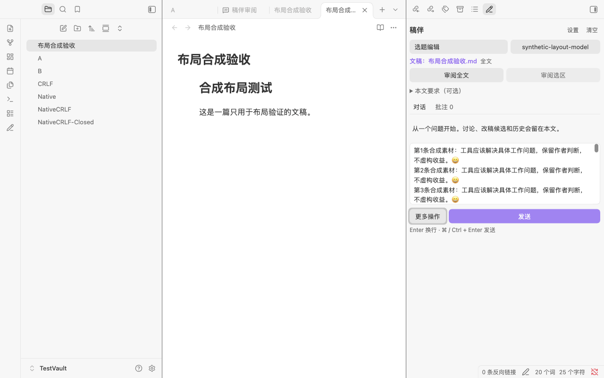
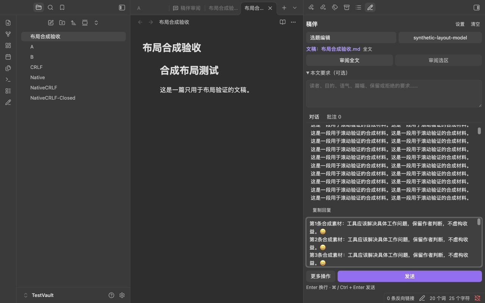

# 0.2.2 侧栏布局更新

本次 0.2.2 布局修复解决了长文本输入会遮住侧栏底部操作，以及空对话留下大块无效留白的问题。布局修复不改写文稿，不改变模型请求内容，并保留既有会话、服务与角色数据；同版本已有的其他改进也保留。

## 变化

- 对话输入会随内容增长到约五行；之后在输入框内部滚动，不能再通过拖拽无限增高。完整粘贴内容仍保留，发送、审阅和停止入口保持可达。
- “更多操作”改为临时浮层菜单，其中包含快捷任务、整篇改稿、选区改稿、删除当前范围和撤回。菜单不参与侧栏的纵向布局，长任务名称会换行，菜单自身可滚动。
- 快捷任务仍然只填入输入框，不会自动发送。菜单可通过点击外部、Escape、切换角色或文稿、窗口变化和关闭侧栏关闭；键盘支持方向键、Home、End 和 Tab 离开菜单。
- 没有对话历史时，阅读区会收紧到提示内容附近；有历史或批注时，阅读区占用剩余空间并独立滚动。低高度侧栏允许整体滚动，以保留输入和主操作行。

## 验证状态

自动化回归、类型检查和生产打包均已完成：当前全套为 223 项测试，分发包只包含三个运行文件，CM/Lezer 由 Obsidian 宿主提供。

在 Obsidian 1.14.4 的独立合成测试库中通过以下检查，未调用模型或发送真实材料：

- 1440×900、1280×800 视口，360/420/480px 侧栏，默认明暗主题，共十二种布局。粘贴 15,491 个字符后全文保留，输入高度不超过 130px，主操作行均在侧栏内，空阅读区小于 105px。
- 输入框和历史区的原生 Chromium 滚轮事件可滚动；浮层可独立滚动，打开浮层不改变输入区高度，Escape 关闭并还原焦点，外部点击关闭，快捷任务只填入输入。
- 长历史、展开本文要求及长输入同时存在时按钮可达；1280×450 低视口通过侧栏整体滚动访问主操作。模拟生成状态中的停止入口可达并可执行。

详细数据见 [layout-verification.json](qa-0.2.2/layout-verification.json)。浅色和深色截图均来自合成测试库：

已将修复运行文件更新到 `personal_database` 并确认启用。安装前通过 Obsidian 文件接口备份并校验原运行文件及数据；重载后逐项确认配置、会话、内存中的草稿以及编辑器全文与选区保留。没有修改真实文稿，没有模型请求。证据见 [本次布局修复安装记录](qa-0.2.2/layout-local-install-verification.json)。原插件目录中的 `rollback-layout-版本-时间戳` 保存回退用文件；需回退时先停用插件，恢复其中三个运行文件再启用，只有确实需要恢复安装时的数据才替换 `data.json`，以免丢失更新后的新会话。

本次尺寸检查使用 Chromium 视口模拟，没有改变用户系统窗口尺寸、侧栏宽度或主题。物理中文输入法候选窗、物理触控板手势、系统缩放和其他第三方主题仍未重新验收；输入法 composition 事件由现有回归测试覆盖。独立测试进程已关闭。源码和 ZIP 均在本地交付，没有提交、推送或发布。
